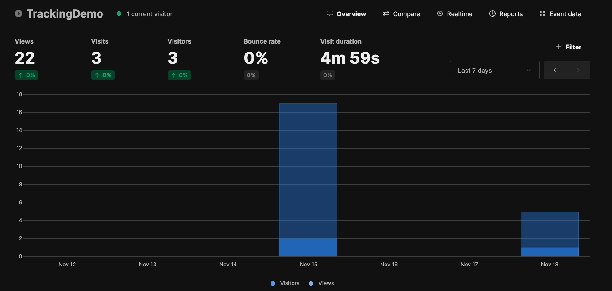

# Tracking Demo: Hugo Site with PaperMod Theme and Umami Analytics

This repository contains the source code for a [Hugo](https://gohugo.io) static site using the [PaperMod](https://themes.gohugo.io/themes/hugo-papermod/) theme. The site is tracked with [Umami Analytics](https://umami.is/) and is deployed via [Cloudflare Pages](https://developers.cloudflare.com/pages/).

## Features

- **Hugo**: Blazing fast static site generator.
- **PaperMod Theme**: Minimal, responsive, and feature-rich Hugo theme.
- **Umami Analytics**: Privacy-focused web analytics integration using PaperMod’s custom Head/Footer feature.
- **Cloudflare Pages Deployment**: Deployed to a global edge network for fast and secure delivery.

## Getting Started

This tutorial will show you how to create a new site from scratch using all the tools mentioned above. You don't need to clone this repository, but you can use it as a guide.

### Prerequisites

- [Hugo](https://gohugo.io/getting-started/quick-start/#prerequisites) installed locally.
- [Git](https://git-scm.com/book/en/v2/Getting-Started-Installing-Git) installed locally.
- A [GitHub account](https://docs.github.com/en/get-started/start-your-journey) to manage the codebase.
- A [Cloudflare account](https://developers.cloudflare.com/fundamentals/) with one registered domain for deployment.
- An [Umami Cloud account](https://umami.is/docs/cloud/) and a website to track visitors.

### Installation

1. **Clone the Repository**
```bash
git clone https://github.com/yourusername/your-repo-name.git
cd your-repo-name
```

2. **Create the Hugo Site**
```bash
hugo new site site-name --format yaml
```

3. **Install PaperMod Theme**
Add PaperMod as a submodule:
```bash
git submodule add https://github.com/adityatelange/hugo-PaperMod.git themes/PaperMod
git submodule update --init --recursive
```
Enable the theme in your hugo.yaml:
```yaml
theme: PaperMod
```

4. **Configure Umami Analytics**
Add your Umami tracking code using PaperMod’s custom Head/Footer functionality:
Create a layouts/partials/head.html file in your project and add the tracking script:
```html
<script async defer data-website-id="YOUR_UMAMI_WEBSITE_ID" src="https://your-umami-instance.com/umami.js"></script>
```

For more information, refer to the [PaperMod’s custom Head/Footer](https://adityatelange.github.io/hugo-PaperMod/posts/papermod/papermod-faq/#custom-head--footer) documentation.


5. **Run the Development Server**
```bash
hugo server
```
The site will be available at http://localhost:1313.

---

### Deployment
Follow these steps to deploy the site using Cloudflare Pages:
1.	Connect Repository:
- Go to your Cloudflare Pages dashboard and create a new project.
- Connect your GitHub repository containing this Hugo site.

2.	Set Build Settings:
- Framework: Hugo
- Build Command: hugo
- Output Directory: public

For more details, see the [Cloudflare Pages guide for Hugo](https://developers.cloudflare.com/pages/framework-guides/deploy-a-hugo-site/).

3.	Deploy:
- Commit and push your changes to the repository.
- Cloudflare Pages will automatically build and deploy your site.

## Umami Analytics Dashboard
Below is a sample screenshot of the Umami dashboard tracking visitor data for your website.


## Resources
- [Hugo Documentation](https://gohugo.io/documentation/)
- [PaperMod Theme Documentation](https://github.com/adityatelange/hugo-PaperMod/wiki)
- [Umami Analytics Documentation](https://umami.is/docs)
- [Cloudflare Documentation](https://developers.cloudflare.com/)

## License
This project is licensed under [MIT License](LICENSE).